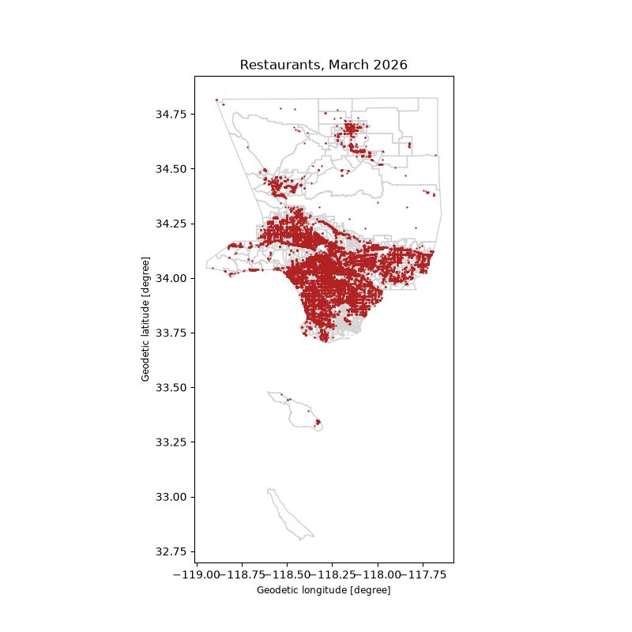

# Food Base LA: data and configuration export

This repository holds the data and configuration behind the **Food Base LA** Food Systems Dashboard, extracted so they can be used outside ArcGIS (R, Python, QGIS, Leaflet/MapLibre, Shiny, etc.).

- Live app: <https://experience.arcgis.com/experience/a4daa72b157b4b969a058909cef387cd/page/Dashboard>
- Built with ArcGIS Experience Builder by the USC Spatial Sciences Institute for the Los Angeles County Office of Food Systems (ArcGIS Online owner: `uscssi_research`).
- Data downloaded on **2026-10-05**: all 245 map layers, about 1 million features.

## Quick start

Clone the repository and work from its root folder. Every layer is listed in [`data/catalog.csv`](data/catalog.csv); pass the name in its `layer` column to `load_layer()`.

### R

```r
# install.packages(c("arrow", "sf"))
source("load_layer.R")

catalog()                                       # all 245 layers
x <- load_layer("Resident_Health_Food_Insecurity_Food_Insecurity_2022")
plot(x["geometry"])                             # x is a regular sf object
```

### Python

```python
# pip install geopandas pyarrow
from load_layer import catalog, load_layer

catalog()                                       # all 245 layers
x = load_layer("Resident_Health_Food_Insecurity_Food_Insecurity_2022")
x.plot()                                        # x is a regular GeoDataFrame
```

Slightly longer versions are in [`examples/example.R`](examples/example.R) and [`examples/example.py`](examples/example.py). Both map the March 2026 restaurant inspections over the county's census tracts:



## How the data is stored

Most layers reuse the exact same shapes. For example, 68 layers use one version of the 2020 census tracts and 61 use another. Repeating those shapes in every file would take ~800 MB, so each distinct set of shapes is stored once:

```
data/
  catalog.csv                     one row per layer: title, group, number of features,
                                  and which attribute and geometry files make it up
  attributes/<layer>.parquet      the layer's table (no shapes) + a geom_id column
  geometries/<set>.parquet        a set of shapes (GeoParquet, EPSG:4326) + a geom_id column
styles/<layer>.json               the layer's ArcGIS symbology, popup and field definitions
```

A layer is its attribute table joined to its geometry file on `geom_id`, which is all `load_layer()` does. Rows with no location in the source have a missing `geom_id`, so they get an empty geometry. The whole dataset is about 200 MB.

The files are standard Parquet, so you can also read them with any Parquet reader (DuckDB, Arrow, Polars, QGIS 3.32+, etc.) and do the join yourself.

**Exactness.** Every layer was checked against the original download. In Python, `load_layer()` gives back the same columns, values and shapes as the downloaded GeoJSON (text columns that are entirely empty come back as `<NA>` instead of `None`). In R it matches `sf::read_sf()` on that GeoJSON, with two small differences in the R loader:

- layers that mix single and multi-part shapes (e.g., POLYGON and MULTIPOLYGON) are returned as all multi-part, as `read_sf()` does;
- 64-bit integer columns (e.g., tract IDs) are returned as numbers rather than `integer64`.

## How the app is put together

An Experience Builder site has no custom source code. It's a set of settings stored as JSON items in ArcGIS Online, all publicly readable through the ArcGIS REST API:

1. **The Experience** (item `a4daa72b157b4b969a058909cef387cd`) holds the pages, layout, text, buttons, theme and widgets. There are 4 pages and 141 widgets.
2. **The web map** (item `2bc29891fc744b62b57de017897583e0`) holds the layer tree, symbology (renderers and class breaks), popups, basemap and extent. It contains **245 layers** in groups such as Food Assistance and Benefits, Retail Food Outlets, Resident Health and Resident Demographics.
3. **The data** lives in 192 hosted feature services: 178 polygon layers (mostly 2020 census tracts) and 67 point layers (restaurants, markets, CalFresh, WIC, farmers' markets).

## What was extracted and how

| File | Contents |
|---|---|
| `item.json` | App metadata (description, credits, tags) |
| `experience_config.json` | Full Experience Builder app definition |
| `webmap.json` | Full web map definition, including styles and popups |
| `layers.csv` | Inventory of all 245 layers: group, title, geometry type, feature count, REST URL, item ID |
| `export_layers.py` | Step 1: downloads every layer from ArcGIS as GeoJSON (into `raw/`) plus its styling (into `styles/`) |
| `build_dataset.py` | Step 2: builds the compact `data/` folder from `raw/` |
| `load_layer.R`, `load_layer.py` | Load a layer from `data/` |

### 1. App and map settings

```bash
curl -s "https://www.arcgis.com/sharing/rest/content/items/a4daa72b157b4b969a058909cef387cd?f=json" -o item.json
curl -s "https://www.arcgis.com/sharing/rest/content/items/a4daa72b157b4b969a058909cef387cd/data?f=json" -o experience_config.json
curl -s "https://www.arcgis.com/sharing/rest/content/items/2bc29891fc744b62b57de017897583e0/data?f=json" -o webmap.json
```

`layers.csv` was built from `webmap.json`, plus a `returnCountOnly` query to each layer for the feature counts.

### 2. Downloading the layers

`export_layers.py` walks the layer tree in `webmap.json`. For each layer it:

- pages through the layer's `/query` endpoint (`where=1=1`, all fields, output in WGS84 / EPSG:4326) and saves a GeoJSON file to `raw/`;
- saves the layer's styling to `styles/`: the renderer (`drawingInfo`), popup configuration and field definitions. Overrides set in the web map take precedence over the service defaults.

It needs only the Python standard library:

```bash
python3 export_layers.py                 # everything, 8 layers at a time
python3 export_layers.py --only "SVI"    # only layers whose title contains "SVI"
python3 export_layers.py --workers 4     # change the number of parallel downloads
```

Rerunning the script skips layers it already has, so an interrupted run can be resumed. The full download is about 2.8 GB of GeoJSON, so `raw/` is not committed.

### 3. Building the compact dataset

```bash
pip install geopandas pyarrow
python3 build_dataset.py
```

This reads `raw/`, groups layers that share identical shapes, and writes `data/` as described above.

To refresh the data later, delete `raw/` and `data/`, then run steps 2 and 3 again.

## What isn't directly portable

- **Symbology** is stored in Esri's renderer JSON format (in `styles/` and `webmap.json`). Other tools need it translated, but the colors, class breaks and labels are all there.
- **Layout and widgets** in `experience_config.json` only run inside Experience Builder. Use the file as a blueprint (text, page structure, links) when rebuilding the site in another framework.

## Data sources and terms

Most layers are hosted by USC SSI. A few boundary layers come directly from LA County and City of LA GIS servers. The underlying datasets come from public sources such as the US Census ACS, CDC, and the LA County Department of Public Health. See the app's "About the Layers" page and the `accessInformation` / `licenseInfo` fields in `item.json` for credits and terms before republishing.
